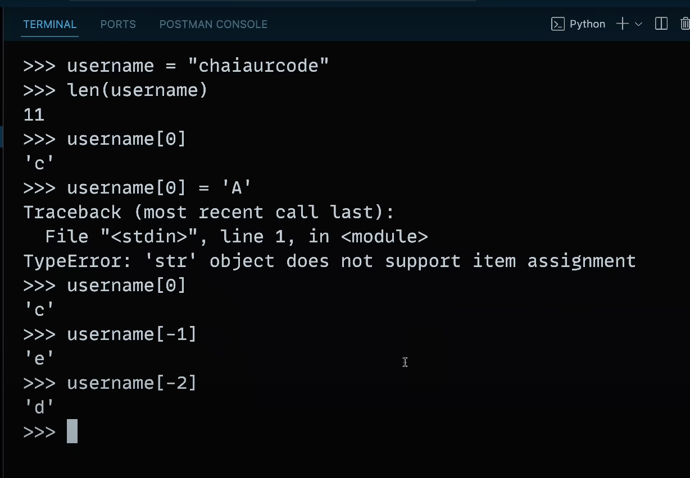
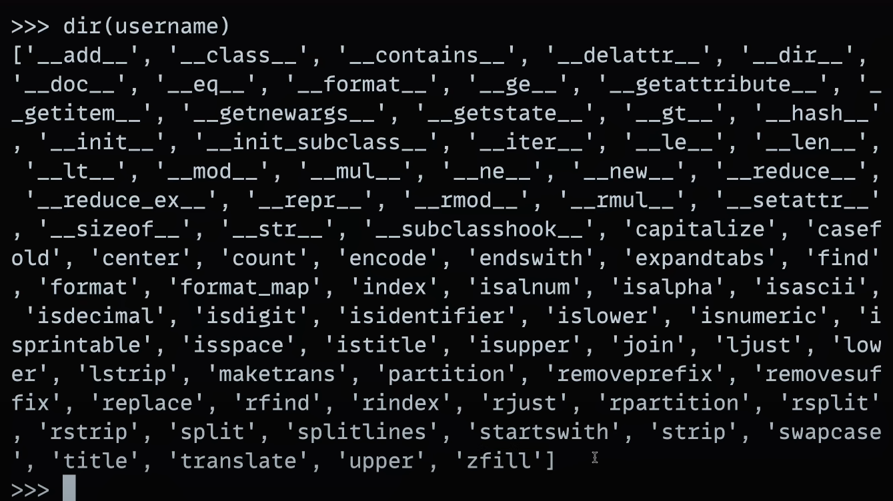

# Object Types / Data Types

- Numbers : 1243, 3.14, 4+3j, 0b113, Decimal(), Fraction()
- String : 'spam', "Bob's", b'a\x01c',
- List : [2, 3, [4, 'five'], 7.2], list(range(4))
- Tuple : (2, 4, 5, 'harshit'), tuple(spam), namedtuple
- Dictionary : {'food' : 'spam', 'taste' : 'yum' }, dict
- Set : set('abc), {'a', 'b', 'c'}
- File : open('eggs.txt'), 
- Boolean : true, false
- None : None

### FUNCTIONS, MODULES, CLASSES
### Advanced : Decorators, Generators, Iterators, MetaProgramming

# IMPORT LIBRARY

# RANDOM VALUE BY GIVING ARRAY

# STRING IS IMMUTABLE

# dir(username)

# In Python list is ARRAY
myList = []

# In Dictionary -> key, value pair

# Tuples
 